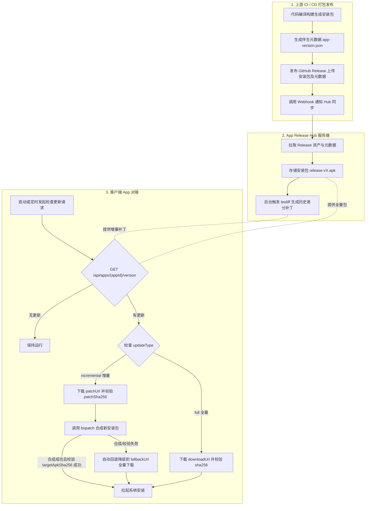

# App Release Hub

<p align="center">
  <strong>轻量、自托管的多平台 App 版本分发与增量差分（bsdiff）更新中心</strong>
</p>

<p align="center">
  <a href="#-系统特性">系统特性</a> •
  <a href="#-对接流程概览">对接流程概览</a> •
  <a href="#-一构建与发布端对接cicd">构建发布端对接</a> •
  <a href="#-二客户端对接集成指南">客户端对接指南</a> •
  <a href="#-三管理后台-api-参考">管理 API 参考</a> •
  <a href="#-四服务端部署与运维">部署与配置</a> •
  <a href="#-五常见问题与避坑指南">常见问题</a>
</p>

---

## 🌟 系统特性

- 📦 **多应用与多平台统管**：单套系统统一管理 Android (`.apk`/`.aab`)、Windows (`.exe`/`.msi`)、macOS (`.dmg`/`.pkg`)、Linux (`.AppImage`/`.deb`)、iOS (`.ipa`) 以及 **UniApp 热更新包 (`.wgt`)** 和 **React Native 离线包 (`.zip`)** 等多端多应用。
- 🔄 **GitHub Release 自动化拉取**：支持公开仓库及私有仓库（按 App 配置独立 Token），一键同步最新发布产物。
- ⚡ **智能 bsdiff 增量差分补丁**：新版本发布时自动与历史版本生成二进制差分包。用户仅需下载几 MB 的补丁即可原地升级，大幅节省 CDN 带宽与用户等待时间。
- ☁️ **对象存储支持 (S3 / R2 / MinIO / OSS / COS)**：支持本地磁盘与 S3 兼容存储无缝切换，大文件并发分片上传，下载直出预签名临时重定向，解耦单机网络带宽。
- 📱 **公开分享落地页 (`/share/:appId`)**：自带蒲公英/fir.im 风格的极简毛玻璃测试分发下载页，免登录直达，附带动态二维码支持手机直接扫码安装。
- 🎛️ **阶梯式灰度发布 (Staged Rollout) & 多渠道隔离**：
  - 基于设备唯一 ID 进行确定性哈希分流 (`1% - 100%`)，支持分批平稳推送。
  - 支持 `stable`、`beta`、`alpha` 等发布通道隔离。
- ⏪ **版本一键回滚 (Rollback)**：生产版本发生致命故障时，可在管理后台一键将任意历史版本恢复为最新生效版本，自动刷新底层软链并触发 Webhook 警报。
- 📊 **设备活跃统计 (UV) & 版本覆盖率分布**：
  - 自动对客户端 `deviceId` 统计去重，呈现全网独立设备装机总量及今日活跃设备数。
  - 提供 Google Play Console 风格的多色堆叠分布进度条与各版本设备占比明细。
- 🔍 **GitHub Release 资产预先预览**：在执行大文件同步前，先实时检测 Release 匹配情况与元数据解析，防止正则或清单配错。
- 🛡️ **安全与流控保护**：
  - **私有包鉴权 (Private App Token)**：开启后仅持有 Client Token 的客户端可查询版本及下载。
  - **细粒度限流 (Rate Limiting)**：API 请求与安装包下载分别施加独立频率限制，防恶意刷量打崩。
  - **并发差分守护**：基于任务队列严格限制 bsdiff 最大并发数，彻底杜绝 CPU/内存被打爆宕机。
- 🔔 **多平台 Webhook 告警与通知**：新版本发布、版本回滚、同步失败时，主动推送格式化卡片至飞书、钉钉、企业微信或自定义 Webhook。
- 🍏 **原生生态对接**：
  - **iOS OTA 原生直接安装**：提供 `install.plist` 协议，Safari 点击即刻调用 `itms-services://` 静默安装。
  - **Electron 自动更新标准**：原生兼容 Squirrel.Mac / Auto-Updater 格式，无缝接入桌面端更新。
  - **跨端热更新包**：原生支持 UniApp (`.wgt`) 与 React Native (`.zip`) 离线增量包，且同样享受底层 bsdiff 差分引擎大幅削减热更体积。
- 📦 **配置批量导入与导出**：一键导出全量 App 配置为 JSON，支持跨环境极速迁移与灾备同步。
- 🗄️ **轻量级零外部数据库依赖**：基于 Node.js LTS + Fastify + SQLite (better-sqlite3)，单机或容器秒级部署，开箱即用。

---

## 🗺️ 对接流程概览



---

## 🚀 一、构建与发布端对接（CI/CD）

当你的 App 仓库完成打包并发布新版本时，需要完成以下两步接入：
1. 在 Release 资产中附带一份 **伴生元数据清单（JSON）**；
2. 在 CI 完成后发送 Webhook 通知 App Release Hub 同步。

### 1. 伴生元数据清单规范 (`app-version.json`)

系统推荐在每次 GitHub Release 中，伴随安装包上传一份 JSON 元数据文件。

#### 文件命名规则
- **平台专属清单（推荐）**：`app-version.<platform>.json`（例如 `app-version.android.json`、`app-version.windows.json`、`app-version.macos.json`）
- **通用清单**：`app-version.json`
- **兼容命名**：`<platform>-version.json`

#### 字段定义与示例

在打包脚本（如 Gradle / Electron Builder / Vite / Makefile）中生成如下 JSON：

```json
{
  "versionCode": 162,
  "versionName": "1.2.62",
  "minVersionCode": 150,
  "forceUpdate": false,
  "fileName": "MyApp-v1.2.62-android.apk",
  "releaseNotes": [
    "新增配方智能校对功能",
    "优化离线缓存加载速度",
    "修复已知 UI 显示异常"
  ],
  "changelogUrl": "https://github.com/your-org/your-app/releases/tag/v1.2.62",
  "publishedAt": "2026-09-07"
}
```

| 字段 | 类型 | 必填 | 默认值 | 说明 |
| :--- | :--- | :---: | :---: | :--- |
| `versionCode` | `number` | **是** | - | 内部纯数字单调递增版本号（Android 的 `versionCode`，Windows/Mac 构建序号） |
| `versionName` | `string` | **是** | - | 展示给用户的语义化版本字符串（如 `"1.2.62"`） |
| `fileName` | `string` | 建议 | 自动推断 | 指定当前 Release 中对应的安装包完整文件名。强烈建议填写，消除多架构或多平台的匹配歧义 |
| `minVersionCode` | `number` | 否 | `1` | 最低兼容运行版本号。客户端版本低于该值将强制升级 |
| `forceUpdate` | `boolean` | 否 | `false` | 是否将此版本标记为强制更新版本 |
| `releaseNotes` | `string[]` | 否 | 抓取 Release body | 更新日志列表。如未提供，系统将自动尝试从 Release 正文中解析列表项 |
| `changelogUrl` | `string` | 否 | Release 链接 | 详细更新说明链接或 Git Commit 比较页面链接 |
| `publishedAt` | `string` | 否 | 当前日期 | 发布日期（格式：`YYYY-MM-DD`） |

---

### 2. GitHub Actions 自动化触发工作流

将以下工作流文件保存至你 App 仓库的 `.github/workflows/notify-release-hub.yml`：

```yaml
name: Notify App Release Hub on New Release

on:
  release:
    types: [published]

jobs:
  notify-hub:
    runs-on: ubuntu-latest
    steps:
      - name: Trigger App Release Hub Sync
        run: |
          curl -X POST "${{ secrets.RELEASE_HUB_URL }}/admin/apps/${{ secrets.RELEASE_HUB_APP_ID }}/sync" \
            -H "X-API-Key: ${{ secrets.RELEASE_HUB_API_KEY }}" \
            -H "Content-Type: application/json" \
            --fail \
            --silent \
            --show-error
```

#### GitHub Secrets 配置
前往你的 App 仓库：**Settings** → **Secrets and variables** → **Actions**，添加以下三个密钥：

| Secret 变量名 | 示例值 | 说明 |
| :--- | :--- | :--- |
| `RELEASE_HUB_URL` | `https://hub.example.com` | App Release Hub 服务端地址（无需末尾斜线） |
| `RELEASE_HUB_APP_ID` | `android-main` | 在 Release Hub 中注册该应用时填写的唯一 `appId` |
| `RELEASE_HUB_API_KEY` | `your-admin-secret-key` | Hub 的管理密钥，对应服务端 `.env` 的 `ADMIN_API_KEY` |

---

### 3. GitLab CI / Jenkins / 脚本自动化通知

如果你使用的是非 GitHub CI 或本地打包脚本，只需在上传完 Release 之后执行一次 HTTP POST 调用：

```bash
curl -X POST "https://hub.example.com/admin/apps/{appId}/sync" \
  -H "X-API-Key: <ADMIN_API_KEY>"
```

- **同步行为**：Release Hub 会请求 GitHub API 拉取该应用对应仓库的最新 Release，下载安装包，计算 SHA-256，保存版本记录，并自动调度后台生成前 3 个历史版本的差分补丁。

---

## 📱 二、客户端对接集成指南

### 1. 检查版本与更新接口

客户端启动或用户点击“检查新版本”时调用此公开接口。

- **请求方式**：`GET`
- **接口地址**：
  - **通用路由**：`/api/apps/{appId}/version?versionCode={currentVersionCode}`
  - **平台专用路由**：`/api/apps/{appId}/version/{platform}?versionCode={currentVersionCode}`  
    （例如 `/api/apps/android-main/version/android?versionCode=158`）
- **请求头**：无需认证，支持标准 HTTP 请求
- **频率限制**：默认单个 IP 最多 60 次/分钟（超出返回 429）

#### 请求 Query 参数
| 参数名 | 类型 | 必填 | 说明 |
| :--- | :--- | :---: | :--- |
| `versionCode` | `number` | **推荐** | 客户端当前安装的数字版本号。不传则无法计算增量包，直接返回全量最新包（也用于**版本覆盖率分布统计**） |
| `deviceId` | `string` | **推荐** | 客户端匿名唯一标识（或通过 Header `x-device-id` 传递）。用于**独立设备 UV 统计**与**按比例灰度发布** |
| `channel` | `string` | 否 | 请求的发布通道，默认为 `stable`，可传 `beta`、`alpha`、`nightly` |
| `token` | `string` | 私有包必填 | 访问私有 App 时的客户端 Token（或通过 Header `x-client-token` 传递） |
| `currentVersionCode` | `number` | 否 | `versionCode` 的别名兼容参数 |
| `policy` | `string` | 否 | 差分未就绪时的临时策略覆盖：`hide_download_link`（默认，不给下载链接）、`silent`（静默不提示）、`fallback_full`（回退全量下载） |

---

### 2. 公开分享下载落地页 (`/share/:appId`)

测试人员或终端用户可在手机浏览器或电脑上直接打开下载落地页：
```http
GET https://hub.example.com/share/{appId}
```
- **特性**：免管理员登录，自适应深浅色，附带动态二维码可供手机相机直接扫码安装。
- **iOS 免签名一键安装**：对于 iOS 平台应用，页面自动对接 Apple 原生 `itms-services://?action=download-manifest&url=.../install.plist`，实现 Safari 点击一键直接安装。
- **私有 App**：若该 App 开启了私有鉴权保护，页面会提示输入访问 Token，校验通过后方可下载。

---

### 3. 原生生态接口对接

#### 🍏 iOS OTA 安装清单接口 (`/api/apps/:appId/install.plist`)
返回符合 Apple Spec 的 `itms-services` manifest XML，供 Safari 唤起系统级应用安装。
```http
GET /api/apps/{appId}/install.plist?token=<client_token>
```

#### 💻 Electron 自动更新接口 (`/api/apps/:appId/update/darwin/:currentVersion`)
完全兼容 Squirrel.Mac 及 `electron-updater` 原生规范：
- 有更新时返回 HTTP 200 及更新元数据 `{ name, notes, pub_date, url }`；
- 无更新时返回 HTTP 204 (No Content)。

---

### 4. 接口响应数据结构详解

所有响应均遵循 Fastify 统一包装格式 `{ code, message, data }`，`code === 0` 代表业务成功。

#### 场景 A：命中增量差分更新 (`updateType: "incremental"`)

当服务端已生成或能够即时生成客户端当前版本到最新版本的差分补丁时返回：

```json
{
  "code": 0,
  "message": "ok",
  "data": {
    "hasUpdate": true,
    "updateType": "incremental",
    "versionCode": 162,
    "versionName": "1.2.62",
    "minVersionCode": 150,
    "forceUpdate": false,
    "releaseNotes": [
      "【v1.2.62】",
      "新增配方智能校对功能",
      "优化离线缓存加载速度",
      "",
      "【v1.2.61】",
      "修复推送通知未及时到达问题"
    ],
    "historyReleaseNotes": [
      {
        "versionCode": 162,
        "versionName": "1.2.62",
        "releaseNotes": ["新增配方智能校对功能", "优化离线缓存加载速度"]
      },
      {
        "versionCode": 161,
        "versionName": "1.2.61",
        "releaseNotes": ["修复推送通知未及时到达问题"]
      }
    ],
    "changelogUrl": "https://github.com/your-org/your-app/releases/tag/v1.2.62",
    "publishedAt": "2026-09-07",
    "fromVersionCode": 158,
    "patchUrl": "https://hub.example.com/api/apps/android-main/patches/patch-v158-to-v162.patch",
    "patchSize": 1843200,
    "patchSha256": "3a4b5c6d7e8f...",
    "targetApkSha256": "9f8e7d6c5b4a...",
    "fallbackUrl": "https://hub.example.com/api/apps/android-main/releases/release-v162.apk",
    "fallbackSize": 52428800
  }
}
```

#### 场景 B：全量更新 (`updateType: "full"`)

无历史差分包、或者全新安装未传 `versionCode` 时返回：

```json
{
  "code": 0,
  "message": "ok",
  "data": {
    "hasUpdate": true,
    "updateType": "full",
    "versionCode": 162,
    "versionName": "1.2.62",
    "minVersionCode": 150,
    "forceUpdate": false,
    "releaseNotes": [
      "新增配方智能校对功能",
      "优化离线缓存加载速度"
    ],
    "historyReleaseNotes": [
      {
        "versionCode": 162,
        "versionName": "1.2.62",
        "releaseNotes": ["新增配方智能校对功能", "优化离线缓存加载速度"]
      }
    ],
    "changelogUrl": "https://github.com/your-org/your-app/releases/tag/v1.2.62",
    "publishedAt": "2026-09-07",
    "downloadUrl": "https://hub.example.com/api/apps/android-main/releases/release-v162.apk",
    "sha256": "9f8e7d6c5b4a...",
    "size": 52428800
  }
}
```

#### 场景 C：无可用更新 (`hasUpdate: false`)

客户端当前已是最新版本：

```json
{
  "code": 0,
  "message": "ok",
  "data": {
    "hasUpdate": false,
    "versionCode": 162,
    "versionName": "1.2.62",
    "minVersionCode": 150,
    "forceUpdate": false,
    "releaseNotes": ["已是最新版本"],
    "downloadUrl": "https://hub.example.com/api/apps/android-main/releases/release-v162.apk",
    "sha256": "9f8e7d6c5b4a...",
    "size": 52428800
  }
}
```

---

### 3. 返回字段全量字典对照表

| 字段 | 类型 | 说明 |
| :--- | :--- | :--- |
| `hasUpdate` | `boolean` | 是否存在高于客户端当前版本的更新 |
| `patchReady` | `boolean` | 差分补丁包是否已就绪。若新版本存在但差分包仍在后台生成中，则为 `false`；就绪后为 `true` |
| `updateType` | `"incremental" \| "full" \| "pending"` | 更新类型：`incremental` 代表增量补丁；`full` 代表全量安装包；`pending` 代表差分生成中待就绪 |
| `versionCode` | `number` | 服务端最新版本的内部版本号 |
| `versionName` | `string` | 服务端最新版本的展示版本名（如 `"1.2.62"`） |
| `minVersionCode`| `number` | 最低兼容版本号 |
| `forceUpdate` | `boolean` | **强制更新标记**。满足以下任一条件即为 `true`：<br>1. 最新版本开启了强制更新；<br>2. 客户端版本低于 `minVersionCode`；<br>3. 客户端版本与最新版本之间的**任意中间版本**曾开启过强制更新 |
| `releaseNotes` | `string[]` | 格式化后的更新日志列表。跨版本更新时自动聚合所有中间版本并加注版本前缀 |
| `historyReleaseNotes` | `Array<{versionCode, versionName, releaseNotes}>` | 结构化的各版本历史日志明细，供客户端自定义复杂 UI 渲染 |
| `changelogUrl` | `string` | 详细发布日志 URL（通常为 GitHub Release 链接） |
| `publishedAt` | `string` | 发布日期（`YYYY-MM-DD`） |
| `downloadBaseUrl` | `string` | CDN 地址前缀（服务端若未配置则为空字符串） |
| **增量字段** | | *(仅在 `updateType === "incremental"` 时返回)* |
| `patchUrl` | `string` | 差分补丁包下载地址（`.patch` 二进制文件） |
| `patchSize` | `number` | 差分补丁大小（单位：字节） |
| `patchSha256` | `string` | 差分补丁文件的 SHA-256 哈希值（小写） |
| `targetApkSha256` | `string`| 合成后**目标完整安装包**必须具备的 SHA-256 哈希值 |
| `fromVersionCode` | `number` | 该差分包所基于的旧版本号 |
| `fallbackUrl` | `string` | **降级全量下载地址**。差分包合成失败或校验失败时使用此地址下载完整包 |
| `fallbackSize` | `number` | 完整安装包的大小（单位：字节） |
| **全量字段** | | *(仅在 `updateType === "full"` 时返回)* |
| `downloadUrl` | `string` | 完整安装包下载地址 |
| `sha256` | `string` | 完整安装包文件的 SHA-256 哈希值 |
| `size` | `number` | 完整安装包的大小（单位：字节） |

---

### 4. 客户端处理流程与状态机

客户端在集成更新时，请务必遵循以下**健壮性原则**：

```
[检查更新] ──> hasUpdate == false ──> 提示已是最新版本
     │
     └──> hasUpdate == true
            │
            ├──> 弹出更新对话框（若 forceUpdate == true 则隐藏取消按钮/禁用关闭）
            │
            ├──> 判断 updateType
            │       │
            │       ├── [full] ──> 下载 downloadUrl ──> 校验 sha256 ──> 调起系统安装
            │       │
            │       └── [incremental]
            │               │
            │               ├── 1. 下载 patchUrl 到临时目录
            │               ├── 2. 校验下载文件 sha256 == patchSha256
            │               │       └─ 校验失败 ──> 转全量降级流程 (fallbackUrl)
            │               ├── 3. 获取当前运行中的原 APK 文件（Android 上通过 context.applicationInfo.sourceDir）
            │               ├── 4. 调用 bspatch.patch(sourceApk, newApk, patchFile)
            │               │       └─ 合成异常 ──> 转全量降级流程 (fallbackUrl)
            │               ├── 5. 校验合成后的 newApk 的 sha256 == targetApkSha256
            │               │       └─ 校验不符 ──> 转全量降级流程 (fallbackUrl)
            │               └── 6. 校验通过 ──> 调起系统安装 newApk
```

> [!IMPORTANT]
> **绝对不可省略 SHA-256 校验**：
> 1. `patchSha256` 保证补丁包传输完整，防止网络丢包或运营商劫持；
> 2. `targetApkSha256` 保证合成出的目标安装包 100% 正确。如果旧版本在用户端被二次加固、重签名或市场渠道重打包，`bspatch` 合成出来的内容一定会损坏，此时**校验哈希失败必须自动无缝转为下载 `fallbackUrl` 全量安装**，切忌让用户流程中断。

---

### 5. 客户端代码集成示例

#### A. Android (Kotlin) 完整实现示例

在 Android 中，增量合成使用开源成熟的 C 库 `bspatch` 即可（可引入现成库如 `implementation("com.github.cankingapp:bspatch:1.0.0")` 或几行 JNI C 代码）。

```kotlin
package com.example.app.updater

import android.content.Context
import android.content.Intent
import android.net.Uri
import android.os.Build
import androidx.core.content.FileProvider
import com.google.gson.Gson
import kotlinx.coroutines.Dispatchers
import kotlinx.coroutines.withContext
import okhttp3.OkHttpClient
import okhttp3.Request
import java.io.File
import java.io.FileOutputStream
import java.security.MessageDigest

// 1. 数据模型定义
data class UpdateApiResponse(val code: Int, val message: String, val data: UpdateData?)
data class UpdateData(
    val hasUpdate: Boolean,
    val updateType: String,       // "incremental" or "full"
    val versionCode: Int,
    val versionName: String,
    val forceUpdate: Boolean,
    val releaseNotes: List<String>,
    // 增量字段
    val patchUrl: String?,
    val patchSha256: String?,
    val targetApkSha256: String?,
    val fallbackUrl: String?,
    // 全量字段
    val downloadUrl: String?,
    val sha256: String?
)

object AppUpdater {
    private val client = OkHttpClient()
    private val gson = Gson()

    /**
     * 检查更新
     */
    suspend fun checkUpdate(context: Context, hubBaseUrl: String, appId: String): UpdateData? = withContext(Dispatchers.IO) {
        val currentCode = if (Build.VERSION.SDK_INT >= Build.VERSION_CODES.P) {
            context.packageManager.getPackageInfo(context.packageName, 0).longVersionCode.toInt()
        } else {
            @Suppress("DEPRECATION")
            context.packageManager.getPackageInfo(context.packageName, 0).versionCode
        }

        val url = "$hubBaseUrl/api/apps/$appId/version/android?versionCode=$currentCode"
        val request = Request.Builder().url(url).header("Cache-Control", "no-cache").build()
        val response = client.newCall(request).execute()
        val json = response.body?.string() ?: return@withContext null

        val result = gson.fromJson(json, UpdateApiResponse::class.java)
        return@withContext if (result.code == 0 && result.data?.hasUpdate == true) result.data else null
    }

    /**
     * 执行下载与安装
     */
    suspend fun performUpdate(
        context: Context,
        data: UpdateData,
        onProgress: (percent: Int) -> Unit,
        onError: (message: String) -> Unit
    ) = withContext(Dispatchers.IO) {
        val downloadDir = context.getExternalFilesDir(null) ?: context.filesDir

        if (data.updateType == "incremental" && !data.patchUrl.isNullOrEmpty()) {
            val patchFile = File(downloadDir, "update-${data.versionCode}.patch")
            val targetApk = File(downloadDir, "app-v${data.versionCode}-merged.apk")

            try {
                // 1. 下载差分补丁包
                downloadFile(data.patchUrl, patchFile)

                // 2. 校验补丁文件哈希
                if (!verifyFileSha256(patchFile, data.patchSha256 ?: "")) {
                    throw IllegalStateException("差分补丁 SHA-256 校验不匹配，降级全量更新")
                }

                // 3. 获取本机当前已安装的 base.apk 路径
                val currentApkPath = context.applicationInfo.sourceDir

                // 4. 调用 bspatch 合成 (需要集成 bspatch JNI)
                // 示例调用: BsPatchUtil.patch(currentApkPath, targetApk.absolutePath, patchFile.absolutePath)
                val patchSuccess = simulateOrCallBsPatch(currentApkPath, targetApk.absolutePath, patchFile.absolutePath)
                if (!patchSuccess) {
                    throw IllegalStateException("增量合并过程失败，降级全量更新")
                }

                // 5. 校验合并后的新 APK 哈希
                if (!verifyFileSha256(targetApk, data.targetApkSha256 ?: "")) {
                    throw IllegalStateException("合成新 APK 哈希校验失败，降级全量更新")
                }

                // 6. 安装合成后的 APK
                installApk(context, targetApk)
                return@withContext
            } catch (e: Exception) {
                // 自动优雅降级到全量包
                fallbackToFullInstall(context, data.fallbackUrl ?: data.downloadUrl ?: "", downloadDir, data.versionCode, onError)
            } finally {
                patchFile.delete()
            }
        } else {
            // 全量更新模式
            val fullUrl = data.downloadUrl ?: data.fallbackUrl ?: return@withContext
            fallbackToFullInstall(context, fullUrl, downloadDir, data.versionCode, onError)
        }
    }

    private fun fallbackToFullInstall(
        context: Context,
        url: String,
        dir: File,
        targetCode: Int,
        onError: (String) -> Unit
    ) {
        val apkFile = File(dir, "app-v$targetCode-full.apk")
        try {
            downloadFile(url, apkFile)
            installApk(context, apkFile)
        } catch (e: Exception) {
            onError("全量下载更新失败: ${e.message}")
        }
    }

    private fun downloadFile(url: String, dest: File) {
        val req = Request.Builder().url(url).build()
        val res = client.newCall(req).execute()
        res.body?.byteStream()?.use { input ->
            FileOutputStream(dest).use { output -> input.copyTo(output) }
        }
    }

    fun verifyFileSha256(file: File, expectedHash: String): Boolean {
        if (!file.exists() || expectedHash.isBlank()) return false
        val digest = MessageDigest.getInstance("SHA-256")
        file.inputStream().use { fis ->
            val buffer = ByteArray(8192)
            var bytesRead: Int
            while (fis.read(buffer).also { bytesRead = it } != -1) {
                digest.update(buffer, 0, bytesRead)
            }
        }
        val actualHash = digest.digest().joinToString("") { "%02x".format(it) }
        return actualHash.equals(expectedHash.trim(), ignoreCase = true)
    }

    private fun installApk(context: Context, apkFile: File) {
        val intent = Intent(Intent.ACTION_VIEW).apply {
            flags = Intent.FLAG_ACTIVITY_NEW_TASK or Intent.FLAG_GRANT_READ_URI_PERMISSION
            val uri: Uri = FileProvider.getUriForFile(context, "${context.packageName}.fileprovider", apkFile)
            setDataAndType(uri, "application/vnd.android.package-archive")
        }
        context.startActivity(intent)
    }

    // 占位示意：实际项目请接入原生 bspatch 库
    private fun simulateOrCallBsPatch(oldPath: String, newPath: String, patchPath: String): Boolean {
        // 调用原生 C 动态库: com.canking.bspatch.BsPatch.patch(oldPath, newPath, patchPath) == 0
        return true 
    }
}
```

---

#### B. Flutter / Dart 接入示例

使用 `http` 或 `dio` 库请求更新接口：

```dart
import 'dart:convert';
import 'package:http/http.dart' as http;

Future<void> checkAppUpdate({
  required String hubUrl,
  required String appId,
  required int currentVersionCode,
}) async {
  final uri = Uri.parse('$hubUrl/api/apps/$appId/version?versionCode=$currentVersionCode');
  final response = await http.get(uri);

  if (response.statusCode == 200) {
    final body = json.decode(response.body);
    if (body['code'] == 0 && body['data'] != null) {
      final data = body['data'];
      if (data['hasUpdate'] == true) {
        final bool forceUpdate = data['forceUpdate'] ?? false;
        final String updateType = data['updateType']; // "incremental" or "full"
        final List<String> releaseNotes = List<String>.from(data['releaseNotes'] ?? []);
        
        print('发现新版本: ${data['versionName']} (Code: ${data['versionCode']})');
        print('更新类型: $updateType, 是否强更: $forceUpdate');
        print('更新日志:\n${releaseNotes.join("\n")}');

        if (updateType == 'incremental') {
          final String patchUrl = data['patchUrl'];
          final String targetSha256 = data['targetApkSha256'];
          // 执行增量下载与合成...
        } else {
          final String downloadUrl = data['downloadUrl'];
          // 执行全量下载...
        }
      }
    }
  }
}
```

---

#### C. Electron / Windows / 桌面端 (Node.js/TypeScript) 示例

在 Electron 或 Node.js 桌面端运行时，同样支持利用系统内置或打包的 `bspatch` 命令行进行无感增量替换：

```typescript
import axios from 'axios';
import { execFile } from 'child_process';
import { createHash } from 'crypto';
import * as fs from 'fs';
import * as path from 'path';

interface VersionResponse {
  hasUpdate: boolean;
  updateType: 'incremental' | 'full';
  versionCode: number;
  versionName: string;
  forceUpdate: boolean;
  releaseNotes: string[];
  patchUrl?: string;
  patchSha256?: string;
  fallbackUrl?: string;
  downloadUrl?: string;
  sha256?: string;
}

export async function checkDesktopUpdate(hubUrl: string, appId: string, currentVersionCode: number) {
  const resp = await axios.get(`${hubUrl}/api/apps/${appId}/version/windows`, {
    params: { versionCode: currentVersionCode }
  });

  const { code, data } = resp.data;
  if (code !== 0 || !data.hasUpdate) {
    console.log('当前已是最新版本');
    return;
  }

  const update: VersionResponse = data;
  console.log(`检测到新版本: v${update.versionName}, 模式: ${update.updateType}`);
  // 根据业务调起 UI 弹框或下载全量/补丁安装器
}
```

---

## 🛠️ 三、管理后台 API 参考

所有 `/admin/*` 开头的管理接口都需要在请求头携带管理员秘钥：
```http
X-API-Key: <ADMIN_API_KEY>
```

### 接口清单一览

| 接口分类 | 方法 | 路径 | 功能说明 |
| :--- | :---: | :--- | :--- |
| **应用注册与配置** | `GET` | `/admin/apps` | 查询所有已纳管的 App 列表 |
| | `POST` | `/admin/apps` | 注册新 App（支持配置私有 Token、最大保留版本、Webhook） |
| | `PATCH` | `/admin/apps/:appId` | 更新 App 配置（名称、仓库、平台、正则、私有状态、Webhook 等） |
| | `DELETE` | `/admin/apps/:appId` | 删除 App（释放配置，保留磁盘数据） |
| | `GET` | `/admin/apps/export` | **导出所有 App 配置为 JSON 文件** |
| | `POST` | `/admin/apps/import` | **批量导入 App 配置 JSON 数组**（自动新建或更新） |
| **同步与导入** | `POST` | `/admin/apps/:appId/sync` | **手动同步单个 App 的最新 Release** |
| | `POST` | `/admin/apps/:appId/sync-history` | **批量导入 GitHub 历史 Release**（可批量补齐历史安装包与说明） |
| | `POST` | `/admin/sync-all` | 立即触发轮询，同步全部开启自动同步的 App |
| | `GET` | `/admin/apps/:appId/preview-release` | **实时检测预览 GitHub Release 资产匹配与元数据清单** |
| **版本管理与控制** | `POST` | `/admin/apps/:appId/versions` | **手动补录历史版本**（支持本地安装包上传或填写外部 URL） |
| | `PATCH` | `/admin/apps/:appId/versions/:versionCode` | **修改版本策略（灰度百分比 / 发布通道 / 强制更新 / 兼容版本 / 日志）** |
| | `DELETE` | `/admin/apps/:appId/versions/:versionCode` | **物理删除指定版本**（级联删除关联差分包并重新计算最新版） |
| | `POST` | `/admin/apps/:appId/versions/:versionCode/rollback` | **一键回滚为此版本**（设为最新生效版，刷新 `latest`，触发告警通知） |
| **差分补丁** | `GET` | `/admin/apps/:appId/patches` | 获取版本差分覆盖矩阵 |
| | `POST` | `/admin/apps/:appId/patches/generate` | 手动为指定的两个版本生成单个补丁 |
| | `POST` | `/admin/apps/:appId/patches/generate-all` | 一键补齐目标版本相对于所有更早历史版本的缺失差分包 |
| | `POST` | `/admin/apps/:appId/patches/upload` | **手动上传外部准备好的 `.patch` 文件** |
| **统计与监控** | `GET` | `/admin/stats/overview` | 全局统计数据（总 App 数、总检查/下载次数、今日活跃设备 UV） |
| | `GET` | `/admin/apps/:appId/stats` | 单个 App 统计（检查/下载量、近 7 天趋势、设备 UV、**版本覆盖率分布**） |
| **Webhook 告警** | `POST` | `/admin/apps/:appId/webhook/test` | **向 App 配置的 Webhook 发送一条测试消息** |

---

### 常用管理操作示例

#### 1. 注册新 App (`POST /admin/apps`)
```bash
curl -X POST "https://hub.example.com/admin/apps" \
  -H "X-API-Key: your-secret-key" \
  -H "Content-Type: application/json" \
  -d '{
    "appId": "android-main",
    "name": "移动端 Android 主版",
    "platform": "android",
    "githubRepo": "your-org/your-android-app",
    "autoSync": true,
    "autoSyncIntervalMinutes": 30,
    "assetPattern": ".*-release\\.apk$"
  }'
```

#### 2. 修改版本策略：开启强制更新 (`PATCH /admin/apps/:appId/versions/:versionCode`)
```bash
curl -X PATCH "https://hub.example.com/admin/apps/android-main/versions/162" \
  -H "X-API-Key: your-secret-key" \
  -H "Content-Type: application/json" \
  -d '{
    "forceUpdate": true,
    "minVersionCode": 158,
    "releaseNotes": ["紧急修复：支付模块安全加固，旧版将停止服务"]
  }'
```

#### 3. 删除有问题的版本 (`DELETE /admin/apps/:appId/versions/:versionCode`)
```bash
curl -X DELETE "https://hub.example.com/admin/apps/android-main/versions/161" \
  -H "X-API-Key: your-secret-key"
```
> **注意**：如果被删除的是当前最新版本，系统会自动在剩余历史版本中将版本号最高的记录提拔为最新版本，并自动更新磁盘上的 `latest.{ext}` 软链/拷贝。

---

## 🎯 四、多平台资产匹配规则（Asset Resolution）

当一个 GitHub 仓库同时为多平台编译产物，或者 Release 中存在签名校验文件（`.sha256`）、调试包等干扰文件时，系统通过以下 **3 级优先级** 锁定正确的安装包：

```
优先级 1：app-version.json 中的 "fileName" 字段（绝对精确匹配）
     ↓
优先级 2：App 配置的 "assetPattern" 正则表达式（灵活自定义）
     ↓
优先级 3：内置平台智能启发式过滤（开箱即用）
```

### 各平台 `assetPattern` 正则推荐设置

| 目标平台 | 安装包典型命名示例 | 推荐 `assetPattern` 正则 |
| :--- | :--- | :--- |
| **Android** | `app-release-v1.0.apk` | `.*\.apk$` |
| **Windows x64** | `MyApp-Setup-1.0.0-win-x64.exe` | `.*-win-x64\.exe$` 或 `.*-Setup.*\.exe$` |
| **macOS (Apple Silicon)** | `MyApp-1.0.0-mac-arm64.dmg` | `.*-mac-arm64\.dmg$` |
| **macOS (Intel)** | `MyApp-1.0.0-mac-x64.dmg` | `.*-mac-x64\.dmg$` |
| **Linux (AppImage)** | `MyApp-1.0.0-linux-amd64.AppImage` | `.*\.AppImage$` |
| **iOS** | `MyApp.ipa` | `.*\.ipa$` |
| **UniApp 热更新** | `update-1.0.0.wgt` | `.*\.wgt$` |
| **React Native 热更新** | `bundle-1.0.0.zip` | `.*\.zip$` |

> 系统内置过滤黑名单：自动过滤 `.sha256`、`.md5`、`.blockmap`、`.sig`、`-unaligned.apk`、`uninstall.exe` 等非安装器文件。

---

## 🚢 五、服务端部署与运维

### 1. 部署方式

- **方式 A：Docker Compose 一键容器化部署（推荐）**
  ```bash
  git clone https://github.com/your-org/app-release-hub.git
  cd app-release-hub
  cp backend/.env.example backend/.env
  vim backend/.env
  docker-compose up -d
  ```

- **方式 B：Debian 13 原生直接部署（Node.js 24 LTS + Nginx 最新版 + acme.sh）**
  适用于不使用 Docker 的裸机生产环境，详见专门的部署文档：
  👉 **[Debian 13 原生部署完整教程（Node 24 + Nginx 最新版 + acme.sh SSL）](docs/deploy-debian13.md)**


### 2. 环境变量一览 (`backend/.env`)

| 环境变量 | 必填 | 默认值 | 说明 |
| :--- | :---: | :--- | :--- |
| `PORT` | 否 | `3000` | 后端服务监听端口 |
| `HOST` | 否 | `0.0.0.0` | 监听地址 |
| `ADMIN_API_KEY` | **是** | - | **管理接口请求鉴权密钥**，建议生成长随机串 |
| `AUTO_SYNC_INTERVAL_MINUTES` | 否 | `60` | 自动轮询同步周期（分钟）。设为 `0` 可关闭轮询只依赖 Webhook |
| `DOWNLOAD_BASE_URL` | 否 | 留空 | **CDN 加速域名**（如 `https://cdn.example.com`）。配置后返回给客户端的文件下载链接将加上此前缀 |
| `GITHUB_TOKEN` | 否 | - | 全局 GitHub Personal Access Token（访问公开仓库不需要，私有仓库需配置） |
| `GITHUB_TOKEN_<APPID>` | 否 | - | 单独为某个 App 配置独立的 Token，如 `GITHUB_TOKEN_ANDROID_MAIN=ghp_xxx` |
| `DB_PATH` | 否 | `data/hub.db` | SQLite 数据库存储路径 |
| `FILES_DIR` | 否 | `data/files` | 本地安装包和补丁文件存储目录 |
| **存储配置 (S3 / 对象存储)** | | | |
| `STORAGE_TYPE` | 否 | `local` | 存储驱动类型：`local`（本地磁盘）或 `s3`（AWS S3 / R2 / MinIO / OSS / COS） |
| `S3_ENDPOINT` | 否 | 留空 | S3 兼容服务节点地址（如 `https://s3.us-east-1.amazonaws.com` 或 MinIO 节点） |
| `S3_REGION` | 否 | `auto` | 存储桶区域（如 `us-east-1`、`auto`） |
| `S3_BUCKET` | 否 | 留空 | 存储桶名称 |
| `S3_ACCESS_KEY` | 否 | 留空 | 访问凭据 Access Key ID |
| `S3_SECRET_KEY` | 否 | 留空 | 访问凭据 Secret Access Key |
| `S3_PUBLIC_DOMAIN` | 否 | 留空 | 对象存储绑定的公开 CDN 域名（公开 App 可选） |
| **高并发与性能流控** | | | |
| `MAX_CONCURRENT_BSDIFF` | 否 | `2` | 允许同时执行二进制差分的最大进程数，防止 CPU 耗尽 |
| `RATE_LIMIT_PUBLIC` | 否 | `60` | 公共 API（版本检查、Plist、Electron）每分钟每 IP 限流次数 |
| `RATE_LIMIT_DOWNLOADS` | 否 | `30` | 安装包与 Patch 直接下载每分钟每 IP 限流次数 |
| `ENABLE_NGINX_ACCEL` | 否 | `false` | 是否开启 Nginx `X-Accel-Redirect` 内网静态文件加速 |
| `NGINX_INTERNAL_PATH_PREFIX` | 否 | `/internal-files` | Nginx 内部保护静态路径前缀 |

---

### 3. Nginx 反向代理与缓存配置建议

如需挂载在顶级域名并启用 HTTPS，推荐的 Nginx 配置如下：

```nginx
server {
    listen 443 ssl http2;
    server_name hub.example.com;

    # SSL 证书配置...

    # 1. 客户端版本检查接口：严禁浏览器或代理层缓存！
    location ~* ^/api/apps/[^/]+/version {
        proxy_pass http://127.0.0.1:3000;
        proxy_set_header Host $host;
        proxy_set_header X-Real-IP $remote_addr;
        proxy_set_header X-Forwarded-For $proxy_add_x_forwarded_for;
        add_header Cache-Control "no-store, no-cache, must-revalidate";
    }

    # 2. 静态安装包与差分补丁：支持断点续传与大文件分块
    location ~* ^/api/apps/[^/]+/(releases|patches)/ {
        proxy_pass http://127.0.0.1:3000;
        proxy_set_header Host $host;
        proxy_set_header X-Real-IP $remote_addr;
        proxy_set_header X-Forwarded-For $proxy_add_x_forwarded_for;
        
        # 允许大文件流式传输
        proxy_buffering off;
        proxy_read_timeout 600s;
        client_max_body_size 2048M;
    }

    # 3. 后台管理接口与前端资源
    location / {
        proxy_pass http://127.0.0.1:8080;
        proxy_set_header Host $host;
        proxy_set_header X-Real-IP $remote_addr;
    }
}
```

---

## ❓ 六、常见问题与避坑指南

### Q1: 增量补丁（bsdiff）合成后校验失败或者闪退怎么办？
**答**：
1. **签名一致性**：Android 平台的 APK 必须保证旧版本与新版本使用的是**完全相同的签名证书**（V1/V2/V3），并且没有经过第三方加固混淆后的随机重排。若在应用市场下载的 APK 与 GitHub Release 中的 APK 被应用市场二次加固，二进制哈希将发生改变，导致合成校验失败。此时客户端的自动降级机制会生效，平滑回退至全量下载。
2. **校验 SHA-256**：客户端在调用 `bspatch` 合成后，**必须比对目标文件哈希与服务端返回的 `targetApkSha256`**。只要哈希一致，100% 说明与发布的完整包完全无二，可以放心安装。

### Q2: 客户端很久没有升级（跳过了好几个版本），增量更新还能用吗？
**答**：
完全可以！
1. **自动前向生成**：发布新版本时，Hub 默认会自动为最近 3 个历史版本提前生成差分包；
2. **即时动态补算**：如果一个更早版本的客户端（如 v100 直升 v105）发来请求，Hub 在发现缓存未命中且旧版本文件存在时，会在 6 秒内动态触发 `bsdiff` 算好补丁并返回。若补算超时或历史文件缺失，则会自动优雅返回 `updateType: "full"` 全量安装包，绝不阻断用户更新。
3. **多版本日志聚合**：跳版本更新时，服务端会自动聚合跨越的所有中间版本的日志（按版本倒序排列并附带 `v1.2.3: ` 前缀）。

### Q3: 为什么强制更新策略建议在服务端动态配置，而不是客户端写死？
**答**：
服务端配置强制更新具有极大的灵活性：
- 当发布了严重漏洞修复版本时，可在 Hub 管理后台立即将该版本切换为 `forceUpdate: true`，或调高 `minVersionCode`；
- 所有受影响的旧版本客户端在下次请求接口时，收到的 `forceUpdate` 即刻为 `true`，立即锁定更新弹窗，无需重新发版。

### Q4: 新版本刚发布，差分包还在生成中时，检查更新会发生什么？
**答**：
Hub 提供了灵活的“差分就绪策略（Patch Readiness Policy）”，可在 App 配置中设置默认行为，也允许客户端通过请求参数 `?policy=` 动态指定：
1. **隐藏下载链接（默认推荐 `hide_download_link`）**：
   服务端返回 `hasUpdate: true` 与 `patchReady: false`，但 `downloadUrl` 与 `patchUrl` 均为 `null`。客户端可提前向用户展示新版本日志，但下载按钮置灰或显示“差分准备中，请稍候”，待几秒后差分就绪即可极速下载，避免用户误下几十兆全量包浪费流量。
2. **完全静默等待（`silent`）**：
   差分包生成完毕前，直接返回 `hasUpdate: false`，不打扰用户；待差分就绪后的下一次检查才提示更新。
3. **回退全量包（`fallback_full`）**：
   差分包尚未就绪时，直接提供完整安装包的 `downloadUrl`。

---

## 📄 License

MIT License.
