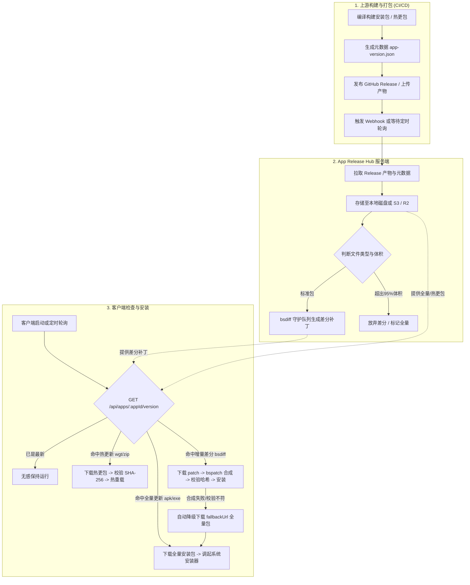

# App Release Hub

<p align="center">
  <strong>🔥 高性能、企业级自托管多平台 App 版本分发与热更新 / 增量差分（bsdiff）中心</strong>
</p>

<p align="center">
  <a href="#-系统核心特性">系统特性</a> •
  <a href="#-全链路架构与时序">架构与时序</a> •
  <a href="#-一构建与发布端对接cicd">构建发布端</a> •
  <a href="#-二热更新与增量差分专题深度指南">🔥 热更新与差分专题</a> •
  <a href="#-三多端客户端对接全景指南">客户端对接指南</a> •
  <a href="#-四管理后台-api-参考">管理 API 参考</a> •
  <a href="#-五服务端部署与运维">部署与运维</a> •
  <a href="#-六常见问题与避坑指南">避坑指南</a>
</p>

---

## 🌟 系统核心特性

- 📦 **全端生态统管**：
  - **原生应用**：Android (`.apk`/`.aab`)、Windows (`.exe`/`.msi`)、macOS (`.dmg`/`.pkg`)、Linux (`.AppImage`/`.deb`)、iOS (`.ipa`)；
  - **跨端热更新**：**UniApp 资源热更新包 (`.wgt`)**、**React Native 离线增量包 (`.zip`/`.bundle`)**，原生免应用商店审核秒级上线；
  - **桌面端生态**：原生兼容 Electron Auto-Updater 与 Squirrel.Mac 更新协议。
- 🔥 **智能 bsdiff 二进制差分引擎**：
  - 新版本发布时，后台守护队列自动与历史版本生成二进制补丁（Patch）；
  - 差分体积通常仅为原包的 **5% ~ 15%**，大幅降低 CDN 带宽成本与用户等待时间；
  - **差分体积保护 (Patch Size Guard)**：若二进制变化过大（补丁超过原包 95%），自动降级全量包，拒绝无效合成。
- 📂 **大版本二级折叠与多分支归档（Accordion Grouping）**：
  - 智能按语义版本主干（如 `v1.3.x`、`v1.2.x`）聚合折叠；
  - 默认仅展开当前最新活跃分支，历史分支收缩为单行卡片，彻底解决百版本刷屏难题；
  - 具备平滑吸顶、视口滚动补偿与快捷过滤胶囊。
- 🌗 **Web-Admin 三档主题（浅色 / 暗色 / 跟随系统）**：
  - 支持浅色模式、深色模式以及“跟随系统”；
  - 实时响应操作系统外观切换，全页面玻璃质感现代化 UI。
- 🎛️ **阶梯式灰度发布 (Staged Rollout) & 多渠道隔离**：
  - 基于设备唯一 ID（`deviceId`）进行确定性哈希分流 (`1% - 100%`)，支持分批平稳推送；
  - 匿名未登记设备自动回退稳定版，杜绝灰度泄露；
  - 支持 `stable`、`beta`、`alpha`、`nightly` 等发布通道隔离。
- 🔒 **私有包安全鉴权 (Private App Token)**：
  - 开启后仅持有 Client Token 的客户端方可检查更新与下载；
  - 服务端接口自动为下载直链附加安全 Token，第三方原生下载器免传复杂 Header 直接通畅下载。
- ⏪ **版本一键回滚 (Instant Rollback)**：
  - 生产版本发生故障时，后台一键将任意历史版本提拔为最新生效版本，自动切换软链并触发警报。
- 📊 **设备活跃统计 (UV) & 多版本装机覆盖率**：
  - 自动对客户端 `deviceId` 统计去重，统计全网独立设备装机量及今日活跃数；
  - Google Play Console 风格的多色堆叠分布进度条与各版本装机占比。
- ⏰ **单 App 独立自动同步周期**：
  - 每个 App 独立配置 15m/30m/1h/2h/自定义分钟，心跳调度池，并发削峰防打爆上游 GitHub。
- 🔔 **多平台 Webhook 机器人告警**：
  - 新版本同步、版本回滚、同步失败时，主动推送格式化卡片至飞书、钉钉、企业微信。
- ☁️ **对象存储支持 (S3 / R2 / MinIO / OSS / COS)**：
  - 支持本地磁盘与 S3 兼容存储无缝切换，大文件分片流式直传，客户端下载直出预签名临时重定向。
- 📱 **公开分享落地页 (`/share/:appId`)**：
  - 自带蒲公英/fir 风格极简毛玻璃测试分发下载页，免登录直达，附带动态二维码支持手机直接扫码安装；
  - **iOS OTA 原生直接安装**：提供 `install.plist` 协议，Safari 点击即刻调用 `itms-services://` 静默安装。
- 🛡️ **细粒度限流 (Rate Limiting) 与并发差分队列**：
  - 基于 Fastify 内置限流保护，公共检查更新与大文件下载隔离流控，防止恶意刷量。
- 🗄️ **轻量级零外部数据库依赖**：
  - 基于 Node.js LTS + Fastify + SQLite (better-sqlite3)，单容器秒级部署，开箱即用。

---

## 🗺️ 全链路架构与时序



---

## 🚀 一、构建与发布端对接（CI/CD）

### 1. 伴生元数据清单规范 (`app-version.json`)

系统推荐在每次 GitHub Release 中，伴随安装包上传一份 JSON 元数据文件。

#### 文件命名规则
- **平台专属清单（推荐）**：`app-version.<platform>.json`（例如 `app-version.android.json`、`app-version.wgt.json`、`app-version.windows.json`）
- **通用清单**：`app-version.json`
- **兼容命名**：`<platform>-version.json`

#### 字段定义与示例

```json
{
  "versionCode": 162,
  "versionName": "1.2.62",
  "minVersionCode": 150,
  "forceUpdate": false,
  "fileName": "MyApp-v1.2.62.apk",
  "channel": "stable",
  "rolloutPercentage": 100,
  "releaseNotes": [
    "新增配方智能校对功能",
    "优化离线缓存加载速度",
    "修复已知 UI 显示异常"
  ],
  "changelogUrl": "https://github.com/your-org/your-app/releases/tag/v1.2.62",
  "publishedAt": "2026-09-09"
}
```

| 字段 | 类型 | 必填 | 默认值 | 说明 |
| :--- | :--- | :---: | :---: | :--- |
| `versionCode` | `number` | **是** | - | 内部纯数字单调递增版本号（如 Android `versionCode`，UniApp `versionCode`） |
| `versionName` | `string` | **是** | - | 展示给用户的语义化版本字符串（如 `"1.2.62"`） |
| `fileName` | `string` | 建议 | 自动推断 | 当前 Release 对应的文件名（如 `update.wgt`、`app-release.apk`），消除匹配歧义 |
| `minVersionCode` | `number` | 否 | `1` | 最低兼容版本号。客户端低于该值将触发强制更新 |
| `forceUpdate` | `boolean` | 否 | `false` | 是否直接将该版本标记为强制更新 |
| `channel` | `string` | 否 | `stable` | 发布通道：`stable`、`beta`、`alpha` 等 |
| `rolloutPercentage` | `number` | 否 | `100` | 灰度放量比例（`1` 到 `100` 的整数） |
| `releaseNotes` | `string[]` | 否 | 抓取正文 | 更新日志列表。如未提供，自动从 Release 正文中提取列表项 |
| `changelogUrl` | `string` | 否 | Release 链接 | 更新日志完整链接 |
| `publishedAt` | `string` | 否 | 当前日期 | 发布日期（`YYYY-MM-DD`） |

---

### 2. GitHub Actions 自动化触发工作流

将以下文件保存至 App 仓库 `.github/workflows/notify-release-hub.yml`：

```yaml
name: Notify App Release Hub on New Release

on:
  release:
    types: [published]

jobs:
  notify-hub:
    runs-on: ubuntu-latest
    steps:
      - name: Trigger App Release Hub Sync
        run: |
          curl -X POST "${{ secrets.RELEASE_HUB_URL }}/admin/apps/${{ secrets.RELEASE_HUB_APP_ID }}/sync" \
            -H "X-API-Key: ${{ secrets.RELEASE_HUB_API_KEY }}" \
            -H "Content-Type: application/json" \
            --fail \
            --silent \
            --show-error
```

---

## 🔥 二、热更新与增量差分专题深度指南

### 1. UniApp 资源热更新 (`.wgt`) 深度实践

UniApp 是国内主流的跨端移动框架。UniApp 支持两种更新形态：
1. **整包升级 (Native Update)**：修改了 Android/iOS 原生插件、SDK 或底座配置时，必须下载全新 `.apk` / `.ipa` 或跳转应用商店；
2. **资源热更新 (WGT Hot Update)**：仅修改了 Vue 页面、JS 业务逻辑、静态图片或 CSS 时，打包生成 `.wgt` 补丁包，客户端静默下载并快速重启生效。

#### App Release Hub 中对 UniApp 的原生支持：
- 在后台注册 App 时，**平台选择 `UniApp 热更新包 (.wgt)`**；
- 系统自动匹配发布资产中的 `.wgt` / `.zip` 包；
- 接口返回中自动附带 `platform: "wgt"` 及 `isWgt: true`，便于客户端直接分支判断；
- 同样支持 `minVersionCode`、强制更新、跨版本日志叠加以及分批灰度发布！

---

### 2. bsdiff 二进制差分优化与避坑

`bsdiff` 采用后缀排序算法比对两个二进制文件的差异。在处理 Android APK、UniApp WGT、Electron 安装包等 Zip 类压缩产物时，请遵循以下优化原则以实现最高 **90%+** 压缩率：

1. **启用 `zipalign -p 4` 字节对齐**：
   在 Android Gradle 打包脚本中，务必开启 `zipAlign true`。对齐能确保未压缩资源的内部偏移量在版本间一致，使 bsdiff 能够精准命中增量块。
2. **保持 ProGuard / R8 混淆映射表连续**：
   发版时保留上一版的 `mapping.txt`（通过 `-applymapping` 保持方法名混淆字典相同），避免因为 1 行代码修改导致整个 Dex 的符号名称完全打散重排。
3. **消除非确定性时间戳**：
   打 Zip/WGT 包时，避免每次打包把当前时间戳打包写入文件头中。
4. **服务端的差分体积自动保护 (Patch Size Guard)**：
   若两代版本经过不同签名加固导致二进制完全无法复用，生成的补丁可能接近甚至大于原包。App Release Hub 会自动检测，**当差分体积超过原包 95% 时，自动废弃补丁**，指示客户端直接走全量高速下载，避免无益的客户端合成耗时与电量开销。

---

## 📱 三、多端客户端对接全景指南

### 1. 检查版本接口定义

- **请求方式**：`GET`
- **接口地址**：
  - `/api/apps/{appId}/version`
  - `/api/apps/{appId}/version/{platform}`（例如 `/api/apps/my-app/version/android`）
- **请求 Query 参数**：
  - `versionCode`（推荐）：客户端当前安装的纯数字版本号；
  - `deviceId`（推荐）：设备唯一标识（或通过 Header `x-device-id` 传递），用于 **UV 统计与灰度百分比确定性分流**；
  - `channel`（可选）：通道名称，默认 `stable`；
  - `token`（私有 App 必填）：私有 App 访问凭据（或通过 Header `x-client-token` 传递）；
  - `policy`（可选）：差分未就绪时的策略：`hide_download_link`（默认）、`silent`、`fallback_full`。

#### 接口响应数据字段对照表

| 字段 | 类型 | 说明 |
| :--- | :--- | :--- |
| `hasUpdate` | `boolean` | 是否存在高于客户端当前版本的有效更新 |
| `updateType` | `"incremental" \| "full" \| "pending"` | 更新类型：`incremental` (增量差分)、`full` (全量包)、`pending` (生成中) |
| `versionCode` | `number` | 服务端最新版本的内部数字版本号 |
| `versionName` | `string` | 服务端最新版本的语义展示名（如 `"1.2.62"`） |
| `forceUpdate` | `boolean` | **强制更新标记**。命中任意条件即为 `true`（最新版标记强更 / 当前版本低于 `minVersionCode` / 中间版本曾标记强更） |
| `platform` | `string` | 应用平台（`android`、`wgt`、`windows`、`macos`、`ios` 等） |
| `isWgt` | `boolean` | 是否为 UniApp 资源热更新包（快捷布尔标记） |
| `releaseNotes` | `string[]` | 格式化后的更新日志列表。跨多版本时自动按时间倒序聚合并加注版本号标题 |
| `historyReleaseNotes` | `object[]` | 结构化历史版本更新日志明细，供富文本时间线渲染 |
| `targetSha256` | `string` | **目标文件的标准 SHA-256 哈希值**（无论全量还是增量合成后均需比对该哈希） |
| `downloadUrl` | `string` | 全量安装包下载链接（私有 App 已自动包含有效 Token） |
| `patchUrl` | `string` | 增量差分补丁下载链接（仅在 `updateType === "incremental"` 时提供） |
| `patchSha256` | `string` | 差分补丁自身的传输校验 SHA-256 |
| `patchSize` | `number` | 差分补丁字节大小 |
| `fallbackUrl` | `string` | 增量合成失败或校验失败时的**无缝降级全量下载链接** |

---

### 2. UniApp (Vue 3 / Vue 2) 热更新完整实现

直接复制至你的 UniApp 项目（如 `utils/checkUpdate.js`）：

```javascript
/**
 * UniApp 专属版本检查与热更新管理器
 */
export function checkAppUpdate(hubBaseUrl, appId, clientToken = "") {
  // #ifdef APP-PLUS
  plus.runtime.getProperty(plus.runtime.appid, (widgetInfo) => {
    const currentCode = Number(widgetInfo.versionCode);
    const deviceId = plus.device.uuid || "";

    const queryParams = [
      `versionCode=${currentCode}`,
      `deviceId=${encodeURIComponent(deviceId)}`,
      clientToken ? `token=${encodeURIComponent(clientToken)}` : ""
    ].filter(Boolean).join("&");

    uni.request({
      url: `${hubBaseUrl}/api/apps/${appId}/version?${queryParams}`,
      method: "GET",
      success: (res) => {
        if (res.statusCode !== 200 || res.data?.code !== 0 || !res.data?.data) return;
        const data = res.data.data;
        if (!data.hasUpdate) return;

        showUpdateDialog(data);
      }
    });
  });
  // #endif
}

function showUpdateDialog(updateData) {
  const notes = updateData.releaseNotes?.join("\n") || "优化系统体验与性能";
  const title = updateData.forceUpdate ? "⚠️ 必须更新版本" : "发现新版本 " + updateData.versionName;

  uni.showModal({
    title,
    content: notes,
    showCancel: !updateData.forceUpdate,
    confirmText: "立即升级",
    success: (modalRes) => {
      if (!modalRes.confirm) return;
      downloadAndInstall(updateData);
    }
  });
}

function downloadAndInstall(updateData) {
  const downloadUrl = updateData.downloadUrl || updateData.fallbackUrl;
  if (!downloadUrl) return;

  const isWgt = updateData.isWgt || downloadUrl.toLowerCase().endsWith(".wgt");
  uni.showLoading({ title: isWgt ? "热更包下载中..." : "安装包下载中...", mask: true });

  const downloadTask = uni.downloadFile({
    url: downloadUrl,
    success: (res) => {
      uni.hideLoading();
      if (res.statusCode === 200 && res.tempFilePath) {
        if (isWgt) {
          // UniApp 热更新安装
          plus.runtime.install(
            res.tempFilePath,
            { force: false },
            () => {
              uni.showModal({
                title: "更新完成",
                content: "新版本热更新已就绪，点击确定立即重启生效",
                showCancel: false,
                success: () => plus.runtime.restart()
              });
            },
            (err) => {
              uni.showToast({ title: "热更新失败: " + err.message, icon: "none" });
            }
          );
        } else {
          // 全量 APK 安装
          plus.runtime.openFile(res.tempFilePath);
        }
      }
    },
    fail: () => {
      uni.hideLoading();
      uni.showToast({ title: "下载失败，请检查网络", icon: "none" });
    }
  });

  // 监听下载进度
  downloadTask.onProgressUpdate((progress) => {
    // 可绑定到自定义进度条 UI: progress.progress
  });
}
```

---

### 3. Android (Kotlin) 完整增量差分与降级实现

在 Android 端，增量更新使用标准的 `bspatch` 原生库（如 `implementation("com.github.cankingapp:bspatch:1.0.0")`）：

```kotlin
package com.example.app.updater

import android.content.Context
import android.content.Intent
import android.net.Uri
import android.os.Build
import androidx.core.content.FileProvider
import com.google.gson.Gson
import kotlinx.coroutines.Dispatchers
import kotlinx.coroutines.withContext
import okhttp3.OkHttpClient
import okhttp3.Request
import java.io.File
import java.io.FileOutputStream
import java.security.MessageDigest

data class UpdateApiResponse(val code: Int, val message: String, val data: UpdateData?)
data class UpdateData(
    val hasUpdate: Boolean,
    val updateType: String,
    val versionCode: Int,
    val versionName: String,
    val forceUpdate: Boolean,
    val releaseNotes: List<String>?,
    val targetSha256: String?,
    val patchUrl: String?,
    val patchSha256: String?,
    val fallbackUrl: String?,
    val downloadUrl: String?
)

object AndroidAppUpdater {
    private val client = OkHttpClient()
    private val gson = Gson()

    suspend fun checkAndExecute(context: Context, hubUrl: String, appId: String, deviceId: String) = withContext(Dispatchers.IO) {
        val currentCode = if (Build.VERSION.SDK_INT >= Build.VERSION_CODES.P) {
            context.packageManager.getPackageInfo(context.packageName, 0).longVersionCode.toInt()
        } else {
            @Suppress("DEPRECATION")
            context.packageManager.getPackageInfo(context.packageName, 0).versionCode
        }

        val url = "$hubUrl/api/apps/$appId/version/android?versionCode=$currentCode&deviceId=$deviceId"
        val req = Request.Builder().url(url).header("Cache-Control", "no-cache").build()
        val res = client.newCall(req).execute()
        val json = res.body?.string() ?: return@withContext
        val resp = gson.fromJson(json, UpdateApiResponse::class.java)

        if (resp.code == 0 && resp.data?.hasUpdate == true) {
            val data = resp.data
            val downloadDir = context.getExternalFilesDir(null) ?: context.filesDir

            if (data.updateType == "incremental" && !data.patchUrl.isNullOrEmpty()) {
                val patchFile = File(downloadDir, "update-${data.versionCode}.patch")
                val targetApk = File(downloadDir, "app-v${data.versionCode}-merged.apk")

                try {
                    // 1. 下载差分补丁
                    downloadFile(data.patchUrl, patchFile)

                    // 2. 校验补丁文件哈希
                    if (!verifySha256(patchFile, data.patchSha256 ?: "")) {
                        throw IllegalStateException("补丁哈希校验失败")
                    }

                    // 3. 取得运行中原 APK 路径
                    val currentApkPath = context.applicationInfo.sourceDir

                    // 4. 调用原生 bspatch 合成新 APK (com.canking.bspatch.BsPatch)
                    // val ret = BsPatch.patch(currentApkPath, targetApk.absolutePath, patchFile.absolutePath)
                    // if (ret != 0) throw IllegalStateException("bspatch 合成异常")

                    // 5. 校验合成新 APK 哈希（绝对核心：确保与服务端 targetSha256 一致）
                    if (!verifySha256(targetApk, data.targetSha256 ?: "")) {
                        throw IllegalStateException("目标 APK 哈希校验不匹配，触发全量回退")
                    }

                    installApk(context, targetApk)
                    return@withContext
                } catch (e: Exception) {
                    // 自动降级全量更新流程
                    val fallback = data.fallbackUrl ?: data.downloadUrl ?: return@withContext
                    fallbackFullInstall(context, fallback, downloadDir, data.versionCode)
                } finally {
                    patchFile.delete()
                }
            } else {
                val fullUrl = data.downloadUrl ?: data.fallbackUrl ?: return@withContext
                fallbackFullInstall(context, fullUrl, downloadDir, data.versionCode)
            }
        }
    }

    private fun fallbackFullInstall(context: Context, url: String, dir: File, targetCode: Int) {
        val apk = File(dir, "app-v$targetCode-full.apk")
        downloadFile(url, apk)
        installApk(context, apk)
    }

    private fun downloadFile(url: String, dest: File) {
        val req = Request.Builder().url(url).build()
        val res = client.newCall(req).execute()
        res.body?.byteStream()?.use { input ->
            FileOutputStream(dest).use { output -> input.copyTo(output) }
        }
    }

    fun verifySha256(file: File, expected: String): Boolean {
        if (!file.exists() || expected.isBlank()) return false
        val digest = MessageDigest.getInstance("SHA-256")
        file.inputStream().use { fis ->
            val buf = ByteArray(8192)
            var n: Int
            while (fis.read(buf).also { n = it } != -1) digest.update(buf, 0, n)
        }
        val actual = digest.digest().joinToString("") { "%02x".format(it) }
        return actual.equals(expected.trim(), ignoreCase = true)
    }

    private fun installApk(context: Context, file: File) {
        val intent = Intent(Intent.ACTION_VIEW).apply {
            flags = Intent.FLAG_ACTIVITY_NEW_TASK or Intent.FLAG_GRANT_READ_URI_PERMISSION
            val uri = FileProvider.getUriForFile(context, "${context.packageName}.fileprovider", file)
            setDataAndType(uri, "application/vnd.android.package-archive")
        }
        context.startActivity(intent)
    }
}
```

---

### 4. Flutter (Dart) 跨平台对接

```dart
import 'dart:convert';
import 'package:http/http.dart' as http;

Future<void> checkAppUpdate({
  required String hubUrl,
  required String appId,
  required int currentCode,
  String deviceId = '',
}) async {
  final uri = Uri.parse('$hubUrl/api/apps/$appId/version?versionCode=$currentCode&deviceId=$deviceId');
  final res = await http.get(uri);
  if (res.statusCode != 200) return;

  final json = jsonDecode(res.body);
  if (json['code'] == 0 && json['data']?['hasUpdate'] == true) {
    final data = json['data'];
    final bool forceUpdate = data['forceUpdate'] ?? false;
    final String updateType = data['updateType']; // "incremental" or "full"
    final String targetSha256 = data['targetSha256'] ?? '';

    print('发现新版本: v${data['versionName']}, 类型: $updateType, 强更: $forceUpdate');
    // 根据业务展示更新对话框并执行下载安装
  }
}
```

---

### 5. Electron 桌面端自动更新对接

在 Electron 主进程中，既可以直接调用系统或自带的 `bspatch` 替换 `app.asar`，也可以配置 `electron-updater` 原生对接 Hub：

```typescript
import { autoUpdater } from "electron-updater";

export function initDesktopUpdater(hubUrl: string, appId: string) {
  // 设置更新服务提供者为通用 HTTP
  autoUpdater.setFeedURL({
    provider: "generic",
    url: `${hubUrl}/api/apps/${appId}/releases/`,
  });

  autoUpdater.checkForUpdatesAndNotify();
}
```

---

## 🛠️ 四、管理后台 API 参考

所有 `/admin/*` 开头的管理接口都需要在 Header 携带鉴权密钥：
```http
X-API-Key: <ADMIN_API_KEY>
```

### 核心管理接口清单

| 接口分类 | 方法 | 路径 | 功能说明 |
| :--- | :---: | :--- | :--- |
| **应用管理** | `GET` | `/admin/apps` | 获取所有已纳管的 App 列表及状态 |
| | `POST` | `/admin/apps` | 注册新 App（支持平台类型、Token、保留版本、Webhook） |
| | `PATCH` | `/admin/apps/:appId` | 修改 App 配置（名称、自动同步周期、私有状态、密钥等） |
| | `DELETE` | `/admin/apps/:appId` | 注销 App 注册信息 |
| | `GET` | `/admin/apps/export` | **导出所有 App 配置为标准 JSON 数组** |
| | `POST` | `/admin/apps/import` | **批量导入 App 配置**（支持快速迁移与环境克隆） |
| **版本控制** | `POST` | `/admin/apps/:appId/sync` | **手动触发同步最新 Release** |
| | `POST` | `/admin/apps/:appId/sync-history` | **批量导入 GitHub 历史 Release** |
| | `POST` | `/admin/apps/:appId/versions` | **手动补录历史版本**（支持上传本地文件或填写外部链接） |
| | `PATCH` | `/admin/apps/:appId/versions/:versionCode` | **修改版本策略（灰度比例 / 通道 / 强更 / 兼容版本 / 日志）** |
| | `DELETE` | `/admin/apps/:appId/versions/:versionCode` | **删除指定版本**（级联清除补丁并重置最新版） |
| | `POST` | `/admin/apps/:appId/versions/:versionCode/rollback` | **一键回滚为此版本**（设为当前最新生效版本） |
| **差分补丁** | `GET` | `/admin/apps/:appId/patches` | 获取差分矩阵覆盖情况 |
| | `POST` | `/admin/apps/:appId/patches/generate` | 针对指定的两个版本生成单个补丁 |
| | `POST` | `/admin/apps/:appId/patches/generate-all` | 一键补齐目标版本相对于所有历史版本的缺失补丁 |
| **统计与告警** | `GET` | `/admin/stats/overview` | 全局统计（应用总数、检查量、下载量、今日 UV） |
| | `GET` | `/admin/apps/:appId/stats` | 单个 App 统计（趋势图、设备数、**多版本装机占比**） |
| | `POST` | `/admin/apps/:appId/webhook/test` | 发送一条 Webhook 模拟测试通知 |

---

## 🚢 五、服务端部署与运维

### 1. 快速部署方式

#### 方式 A：Docker Compose 一键启动（生产推荐）

```bash
# 1. 克隆代码仓库
git clone https://github.com/librarycloud/app-release-hub.git
cd app-release-hub

# 2. 配置环境变量
cp backend/.env.example backend/.env
vim backend/.env

# 3. 后台启动服务
docker-compose up -d
```

#### 方式 B：裸机原生直接部署（Node.js 24 LTS + Nginx + SQLite）

适用于 Debian 13、Ubuntu 22.04/24.04 等裸机服务器：
👉 **[查看完整的 Debian 13 原生部署指南（含 Nginx 与 Let's Encrypt 证书自动化配置）](docs/deploy-debian13.md)**

---

### 2. 核心环境变量参考 (`backend/.env`)

```ini
# 服务端口与绑定地址
PORT=3000
HOST=0.0.0.0

# 管理后台管理员鉴权密钥 (必填，请生成随机长字符串)
ADMIN_API_KEY=your_super_secret_admin_key_here

# 全局 GitHub Token (访问私有仓库或避免 API 限流时配置)
GITHUB_TOKEN=ghp_xxxxxxxxxxxxxxxxxxxx

# 存储路径
DB_PATH=data/hub.db
FILES_DIR=data/files

# CDN 加速域名 (可选，如配置则向客户端返回前缀)
# DOWNLOAD_BASE_URL=https://cdn.example.com

# 外部对象存储 S3 / R2 / MinIO (可选，不配则存本地磁盘)
STORAGE_TYPE=local
# STORAGE_TYPE=s3
# S3_ENDPOINT=https://<account_id>.r2.cloudflarestorage.com
# S3_BUCKET=app-releases
# S3_REGION=auto
# S3_ACCESS_KEY=xxx
# S3_SECRET_KEY=xxx

# 差分引擎最大并发数 (保护单机 CPU/内存，默认 2)
MAX_CONCURRENT_BSDIFF=2

# 限流设置 (每分钟每 IP)
RATE_LIMIT_PUBLIC=60
RATE_LIMIT_DOWNLOADS=30
```

---

## ❓ 六、常见问题与避坑指南

### Q1: 增量补丁（bsdiff）合成后客户端哈希校验失败怎么办？
**答**：
1. **签名与打包一致性**：Android APK 必须使用相同的签名证书（V1/V2/V3），未经过应用市场二次加固改包；
2. **校验 SHA-256**：客户端合成完成后，**必须比对目标文件哈希与接口返回的 `targetSha256`**。一旦哈希不符，客户端代码内置的降级机制会无缝自动转为下载 `fallbackUrl` 全量包，绝不导致更新流程中断。

### Q2: 客户端跳版本（跨多个版本）更新，还能享受增量吗？
**答**：
完全可以！
1. 服务端默认会在新版发布时自动为最近 3 个版本生成差分；
2. 若客户端来自更早版本，只要服务端保留有该旧版文件，在客户端请求时系统会自动在后台动态触发计算补丁；
3. 同时，更新日志会自动跨版本倒序叠加所有中间更新条目。

### Q3: 为什么 UniApp 热更新有时需要强制重启？
**答**：
UniApp 的 `.wgt` 包含页面的渲染模版与 JS Bundle。如果 App 正在运行中直接替换资源，可能会因内存中已加载旧的组件定义产生异常。最佳做法是在 `plus.runtime.install` 成功后提示用户或静默调用 `plus.runtime.restart()`，重新启动即可瞬间秒级载入新资源。

---

## 📄 开源许可证

本项目基于 [MIT License](LICENSE) 开源发布。
